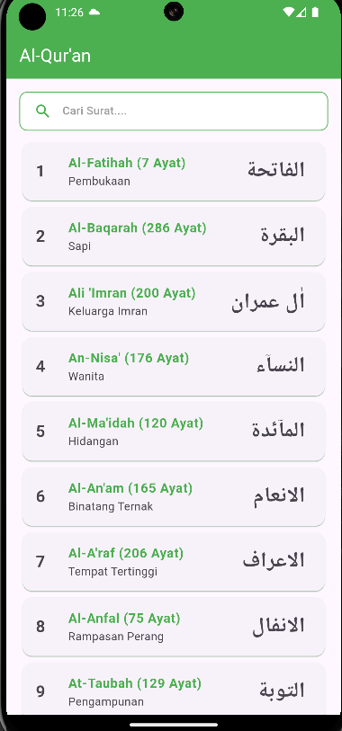
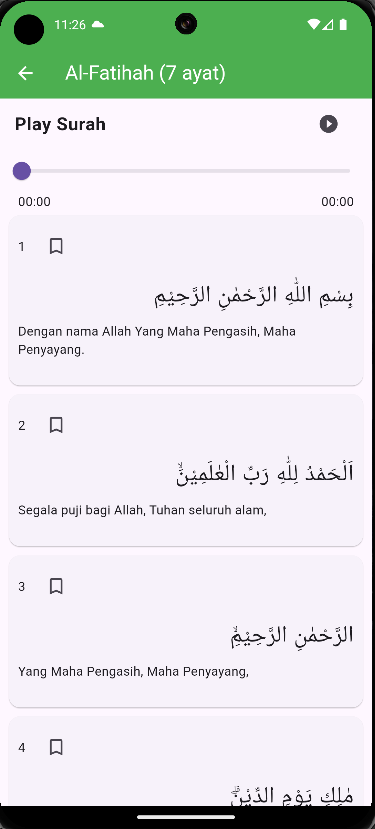
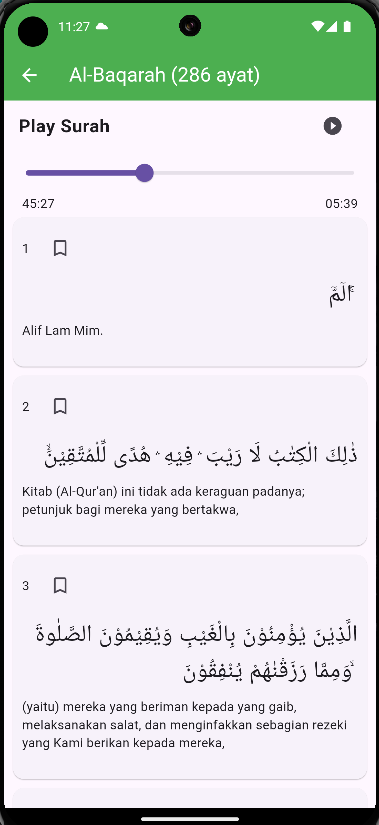

# Quran Player App

## Description

This application is built with **Flutter** using **GetX** as the state management solution. It provides an intuitive interface for users to search and play Al-Qur'an recitations with playback control and progress tracking.

## Required Functionality

### 🔍 Search

- Allows users to search for Al-Qur'an by Surah.

### 🎵 Playback Control

- Implements standard playback functions: **play, pause, resume**.

### ⏳ Progress Display

- Displays the **total duration** of the Surah.
- Shows the **current playback position** using a progress bar.

### ⏩ Seeking

- Enables users to **navigate** through the Surah using a **slider**.

### 🧪 Automation Testing

- Uses **Mockito** for unit and widget testing to ensure reliability and robustness.

## Technologies Used

- **Flutter**
- **GetX** (State Management)
- **Mockito** (Testing)
- **Audio Player Package**

## Installation

1. Clone this repository:
   ```sh
   https://github.com/muhajirilarobbih/muhajir-quran.git
   ```
2. Navigate to the project folder:
   ```sh
   cd muhajir_quran
   ```
3. Install dependencies:
   ```sh
   flutter pub get
   ```
4. Run the application:
   ```sh
   flutter run
   ```

## Screenshots

### 📌 Home Screen



### 📌 Surah Playback - Al-Fatihah



### 📌 Surah Playback - Al-Baqarah



## Testing

To run automated tests using Mockito:

```sh
flutter test
```

## License

This project is licensed under the MIT License. Created by Muhajir ila Robbih.

